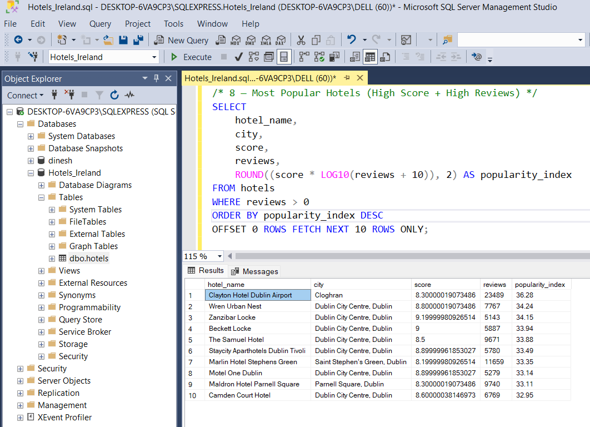
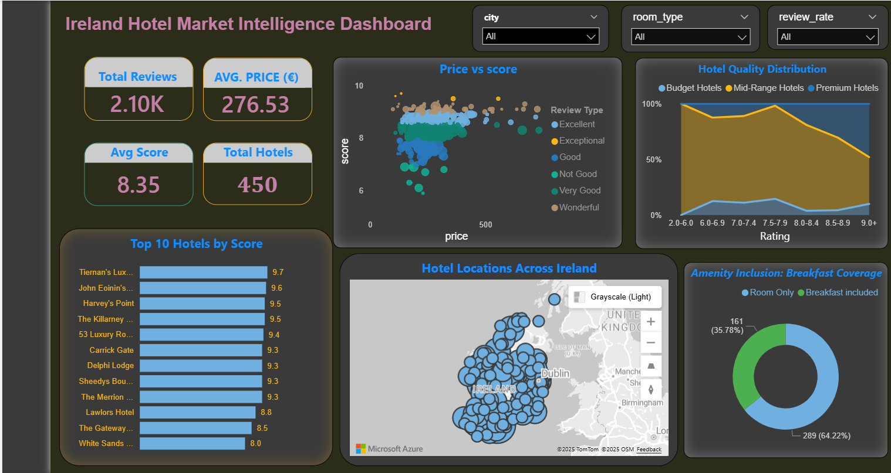

<div align="center">

  <!-- Gradient Banner -->
  


  <!-- Subtitle (Typing animation) -->
  <p>
    
  </p>

  <!-- Tech Stack Badges -->
  <div align="center">

  
  
  
  
  
  
  

  </div>

  <!-- Animated Divider -->
  

</div>


This comprehensive end-to-end data analytics project provides deep insights into Ireland's hotel market using real-world data scraped from Booking.com. The project demonstrates a complete modern data analytics workflow from raw data to actionable business intelligence.


---

## 📌 Project Overview

Understanding hotel pricing, ratings, availability, and review patterns is crucial for tourism insights and hospitality decision-making.  
This project analyzes hotels across major Irish cities to uncover trends in:

- Hotel pricing for weekend stays  
- Rating distributions  
- Review behavior vs. hotel scores  
- Room availability  
- Free cancellation impact  
- City-wise pricing & rating patterns  

The analysis provides actionable insights useful for:

- Tourism boards  
- Hospitality businesses  
- Travelers  
- Market researchers  

---


## 📁 **Repository Structure**
```text
Ireland-Hotels-Pricing-Rating-Analysis/
│
├── data/
│   ├── raw/
│   │   └── hotels.csv                 # Original scraped data
│   └── processed/
│       └── hotels_cleaned.csv          # Cleaned dataset
│
│── ireland_hotels_comprehensive_analysis.ipynb           # Data cleaning & preprocessing
│
├── Hotels_Ireland.sql             # All SQL queries for analysis
│
├── powerbi/
│   └── Ireland_Hotels_Dashboard.pbix  # Power BI dashboard file
│
├──README.md                      # Project documentation
│
├── booking_scraper.py            # Srapes data from Booking.com and generates hotels.csv
├── requirements.txt                   # Python dependencies
└── .gitignore
```


---

## 🔍 Analysis Workflow

## 🏨 1. Data Collection (Web Scraping)

### ✔ Source  
Data was collected from **Booking.com**, focusing on:

- Hotels located in **Ireland**  
- **One-night weekend stay**  
- Extracted using **Instant Data Scraper (Chrome Extension)**  

### ✔ Fields Extracted (Raw Data)
The scraper collected attributes including:

- Hotel Name  
- City  
- Price per Night  
- Score / Rating  
- Number of Reviews  
- Review Category  
- Free Cancellation (Yes/No)  
- Rooms Left  
- Description Snippets  
- Link to Hotel Page  

The scraped dataset was stored as: **hotels_raw.csv**


---

## 🧹 2. Data Cleaning using Python

Cleaning and preprocessing were performed in the Jupyter notebook:


### ✔ Key Cleaning Steps:

- Removed duplicates 
- Cleaned price formatting (`€`, commas, text)  
- Standardized rating and review count fields  
- Extracted numeric values from text fields  
- Cleaned boolean fields (e.g., Free Cancellation)  
- Filled or removed missing values  
- City extraction from hotel location text  
- Exported final cleaned dataset  

#### ✔ Final Cleaned Output:  **hotels_cleaned.csv**


---

## 🗄️ 3. SQL Analysis (SSMS)

- The cleaned dataset was imported into SQL Server Management Studio (SSMS).
- This SQL analysis explores key business questions to derive actionable insights from the Irish hotel market data, covering performance, pricing, availability, and customer perception.


### 🔍 **Key Business Questions Solved (Using SQL + CTEs)**

---

### ⭐ Hotel Quality Analysis

#### Top-Rated Hotels
- Identifies hotels with the highest review scores across Ireland
- Ranks top 10 hotels based on verified rating values

#### City-Level Hotel Quality
- Calculates average hotel score by city
- Highlights cities offering the best-rated accommodation

### 📈 Combined Score & Popularity Metrics

#### Top Hotels by Score + Reviews
- Ranks hotels using a hybrid metric (score + review count)
- Ensures high-scoring hotels with strong customer engagement are prioritized

#### Most Popular Hotels
- Computes a Popularity Index = score × log₁₀(reviews + 10)
- Surfaces hotels with strong reputation and high public trust

### 💰 Price & Value Analysis

#### City-Wise Price Range
- Minimum, maximum, and average hotel prices per city
- Identifies cities with the widest and narrowest price gaps
- Helps understand affordability and luxury concentration

### 🏨 Customer Convenience & Policies

#### Free Cancellation Insights
- Lists high-scoring hotels offering free cancellation
- Useful for travellers seeking flexible booking options

#### 🛏️ Capacity & Booking Insights

#### City Room Availability
- Calculates average rooms left per city
- Indicates cities with higher supply vs. demand pressure

### 🗳️ Review Behavior & Reputation

#### Review Rate Distribution
- Counts hotels by review-rating category
- Shows popularity distribution across review tiers

#### Review Count vs Score Correlation
- Categorizes hotels into review-count ranges
- Analyzes whether higher review volume corresponds with higher scores
- Helps identify credibility and rating reliability


#### 🖼️ Sample SQL Query

<div align="center">
 


</div>


---

# 📊 4. Power BI Dashboard

The cleaned dataset was imported into Power BI to develop a dynamic hotel insights dashboard.


<div align="center">
 
 
  <p>
    <a href="https://www.novypro.com/project/ireland-hotel-intelligence-dashboard/" target="_blank">
      🚀 View Live Dashboard
    </a>
  </p>
  
</div>

## Dashboard Features

### Key Metrics Cards
- **Total Reviews:** 2.10K
- **Average Price (€):** €276.53
- **Average Score:** 8.35
- **Total Hotels:** 450

### Hotel Quality & Revenue
- **Price vs. Score Analysis:** Correlation between hotel price and guest rating
- **Revenue by Guest Rating:** Breakdown by categories (Excellent, Wonderful, Very Good, etc.)
- **Hotel Quality Distribution:** Market split between Budget, Mid-Range, and Premium hotels

### Performance & Distribution
- **Top 10 Hotels by Score:** Highest-rated hotels ranking (Tamara's Lux..., Harvey's Point, etc.)
- **Hotel Locations Across Ireland:** Geographic map showing hotel concentration nationwide
- **Amenity Inclusion - Breakfast Coverage:** 64.22% include breakfast vs. 35.78% Room Only

### Interactive Filters
- Hotel Quality Tier
- Location
- Guest Score Band
- Breakfast Inclusion


---

## 📈 5. Insights & Findings

### **🏆 Top Cities by Rating**
Some Irish cities consistently show higher average hotel scores.

### **💶 Price Trends**
Hotels in cities like Dublin show higher weekend pricing.

### **🛏️ Room Availability**
Certain tourist-heavy locations show low room availability.

### **✔ Free Cancellation Impact**
Hotels offering flexible cancellation often maintain higher ratings.

### **⭐ Review Count vs Rating**
A moderate relationship observed — hotels with high review counts often maintain stable score averages.

---

## 🧩 6. Tools & Technologies Used

| Category | Technology |
|---------|-------------|
| **Web Scraping** | Instant Data Scraper |
| **Data Cleaning** | Python, Pandas, NumPy |
| **Database** | SQL Server (SSMS) |
| **Querying** | SQL, CTEs, Aggregations |
| **Visualization** | Microsoft Power BI |
| **Project Management** | GitHub |

---

## 📋 Prerequisites
- **Python 3.8+**
- **pandas, numpy libraries**
- **Microsoft SQL Server**
- **Power BI Desktop**
- **Jupyter Notebook**


---

## 🛠️ Installation & Setup

### ** 1. Clone the repository**
```bash
git clone https://github.com/dineshbarri/ireland-hotel-pricing-ratings-analysis.git
cd Ireland-Hotel-Pricing-Ratings-Analysis
```


### 2. Running the Notebook

####   Install dependencies:
    python -m venv venv && source venv/bin/activate
    pip install -r requirements.txt

####  Launch Jupyter Notebook:
    jupyter notebook ireland_hotels_comprehensive_analysis

💡 *Note:  Always use a virtual environment for this project to maintain dependency isolation and ensure reproducible results across different systems.*


### 3.  Run SQL Queries(SSMS) 

- Open **SQL Server Management Studio (SSMS)** and create a new database named **Hotels**.
-  Right-click the database → **Tasks → Import Flat File** → load `hotels_cleaned.csv` as table **hotels_cleaned**.
-  Open `sql/Hotels_Ireland.sql` in SSMS and select the **Hotels** database.
-  Run the script (F5) to execute all SQL analysis queries.


### 4. Opening the Power BI Dashboard

  **a) Install Power BI Desktop** (if not already installed)
   - Download from [Microsoft Power BI](https://powerbi.microsoft.com/desktop/)

 **b) Open the Dashboard**:
   - Double-click `Hotels_Ireland_Dashboard.pbix`
   - Or open Power BI Desktop and select File → Open → Browse to the file


---

## 📈 Business Impact

This analysis provides:
- **Strategic Insights** for hotel pricing and positioning
- **Market Intelligence** for new hotel developments  
- **Travel Planning** tools for tourists and business travelers
- **Competitive Analysis** framework for hospitality industry

## 🔮 Future Enhancements

- Real-time data integration
- Seasonal pricing analysis
- Customer sentiment analysis from reviews
- Predictive modeling for pricing optimization
- Mobile app development for travelers

---

## 🤝 Contributing

Contributions, issues, and feature requests are welcome! Feel free to check issues page if you want to contribute.

---


## 👨‍💻 Creator

### Dinesh Barri

#### 📬 Contact Information

- **📧 Email**: [dineshbarri1997@gmail.com](mailto:dineshbarri1997@gmail.com)
-  [](https://github.com/dineshbarri)
-  [](https://www.linkedin.com/in/dinesh-barri-7654b010b)

---


# 📄 License

[](https://opensource.org/licenses/MIT)

This project is licensed under the **MIT License** - see the [LICENSE](LICENSE) file for details.

---

### ⭐ If you like this project, don't forget to give it a star!


